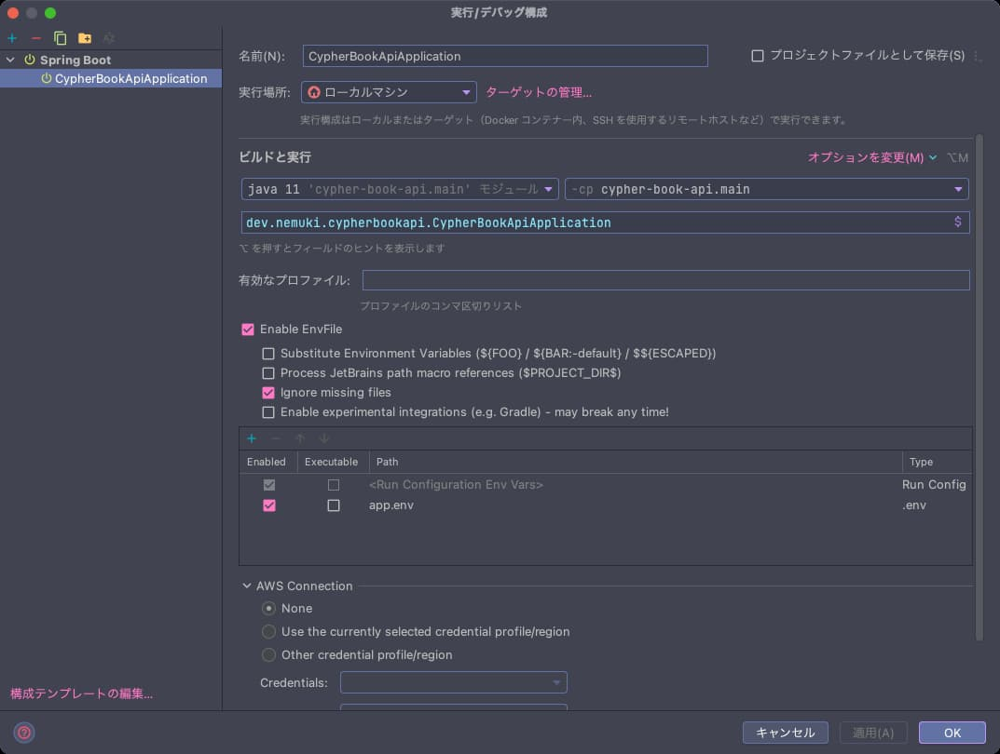

# Cypher Book API

Cypher: Spring BootCamp Book API

## 開発環境

```
MacBook Pro (13-inch, M1, 2020)

IDE: IntelliJ IDEA
JDK: Amazon corretto-11.0.16.1 x86_64
```

## 環境構築

### 環境変数の設定

プロジェクトルートの `app.env.sample` をコピーし、`app.env` を作成します

```shell
cp app.env.sample app.env
```

IntelliJ の [EnvFile](https://plugins.jetbrains.com/plugin/7861-envfile) プラグインをインストールし、
実行構成に `app.env` を追加します。

